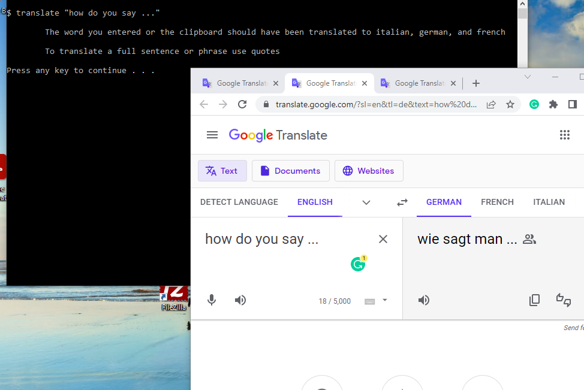

# Translate App

A simple python program that opens google translate and returns the translation of an english phrase in 3 different languages

> [!NOTE]
> A batch script is included to run the python program from the command line but not necessary.

> [!IMPORTANT]
> Make sure you have the **environment path** set correctly, if you're going to use the batch script.
> Ex: documents\batch\translate if you cloned to a documents\batch directory

## How to Run

Type the following the terminal

```console
translate "some phrase"
```



# Todo

- [ ] Allow the user to limit the languages used
- [ ] Allow the option to return the translations in the terminal instead of an open browser

* I created this program because I found it tedious to keep opening google translate over and over again
* I hope you find it as helpful as I did
